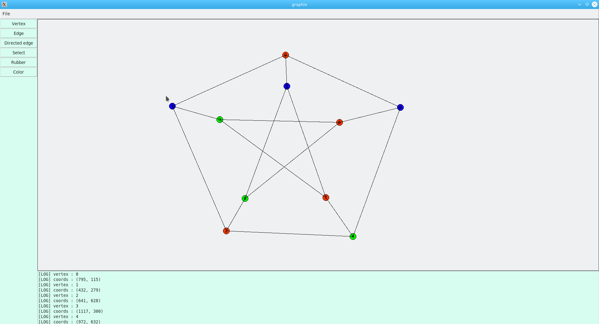

<!--
     ___                     _ __   _         _            
    / __|     _ _   __ _    | '_ \ | |_      (_)    __ __  
   | (_ |    | '_| / _` |   | .__/ | ' \     | |    \ \ /  
    \___|   _|_|_  \__,_|   |_|__  |_||_|   _|_|_   /_\_\  
   _|"""""|_|"""""|_|"""""|_|"""""|_|"""""|_|"""""|_|"""""| 
   "`-0-0-'"`-0-0-'"`-0-0-'"`-0-0-'"`-0-0-'"`-0-0-'"`-0-0-' 
-->

-------------------------------------------------------------

# Graphix

## Python GUI to draw __graphs__ !

-------------------------------------------------------------

### Working on Linux and macOS in  __python3__.

tested on : 

- Fedora 31 
- Ubuntu 18.04
- macOS Monterey 12.2

### Right now you can :

- Draw simple graphs : 
  

- Draw directed and weighted graphs :   
  

- Save the graph you are working on.

- Export the Graph in .png.

- Delete items. 

- Color the verticies and edges.

- Move the different verticies and edges connected to them.

### Libraries needed :

- Tkinter
- Pillow

to install them run : 

```
python3 -m pip install --upgrade pip
python3 -m pip install --upgrade tk
python3 -m pip install --upgrade Pillow
```

to run the program :

```
python3 /graphix/graphs/app.py
```

### Quick tutorial :

- To draw a vertex click on the __Vertex__ button and click where you to put it in the canvas,
  you can choose to add a label, if not it will label it automatically from 0 to +inf.

- To draw and edge between two verticies click on the __Edge__ or __Directed Edge__ button and select the two verticies you want to connect, a window will pop up and ask you want to add a weight to the edge, if no, click cancel. 

- To remove a vertex or an edge use the __Rubber__ button and click on the item you want to delete. If you delete a vertex it will delete all its incident edges. 

- To change a item position click on the __Select__ button, and drag and drop the item at the desired positon. (*sometimes buggy*). 

- To color an edge or a vertex click on the __Color__ button, a color selector window will pop up, select the color and click on the desired item to color, you can color multiple items at once, to change the color click again on the __Color__ button.

### Future work :

- Implement algorithms (Shortest path, Spanning tree, Djikstra...).
- Windows compatibilty.
- Export to tikz for Latex.


